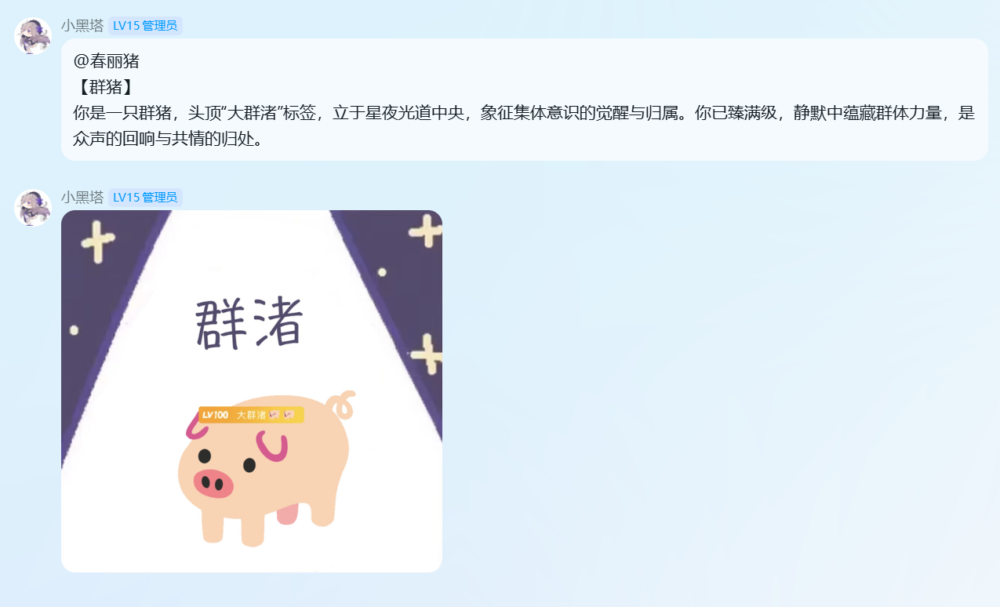
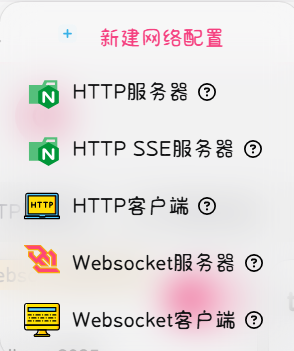
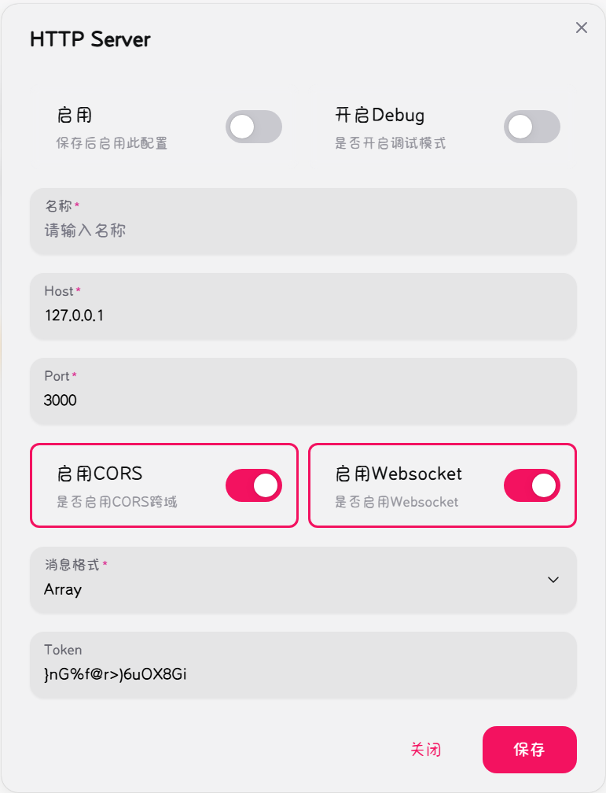

# 🐷 Pighub_plugin（今日猪猪）

MaiBot 插件，每日随机抽取一只猪猪图片并发送，支持 @群友为别人抽取，群名片互动玩法。
截止0.12.2前的Maibot版本可使用。

---

## ✨ 功能特性

- **每日抽取**：同群同用户每日只抽一次，跨天自动刷新
- **@他人**：支持 @群友为别人抽取，@机器人则反弹给自己
- **双模式发送**：支持 Napcat HTTP API 直接发送，也支持 MaiBot 原生逻辑（关闭 Napcat 时使用）
- **群名片互动**：抽取后自动将对方群名片改为猪猪名称，每日 0 点自动恢复
- **权限控制**：管理员功能（改名片）可限定指定群聊生效
- **群隔离缓存**：不同群的缓存互不影响

---

## 📦 手动安装

将本文件夹复制到 MaiBot 的 `plugins/` 目录下，重启 Bot 即可自动加载。

目录结构：
```
plugins/Pighub_plugin/
├── plugin.py        # 插件入口
├── commands.py      # 命令逻辑
├── config.toml      # 配置文件
├── text.json        # 猪猪描述文本
├── data/            # 猪猪图片文件夹
└── README.md
```

---

## ⚙️ 配置说明

编辑 `config.toml`：

```toml
[general]
# 是否启用插件
enable = true

[napcat]
# 是否使用 Napcat HTTP API 发送消息
enable = true

# NapCat HTTP 服务器地址（默认127.0.0.1）
napcat_host = "127.0.0.1"

# NapCat HTTP 服务器端口（默认3000）
napcat_port = 3000

# NapCat Access Token（如配置了 token 请填写，否则留空）
napcat_token = ""

[mock]
# 是否将命令回复添加进数据库（影响麦麦上下文）
enable = true

[admin]
# 是否启用自动更改群名片的管理员功能
enable = true

# 允许使用管理员功能的群号列表，为空则不限制
allowed_groups = []
```

---

## 🤖 命令列表

| 命令 | 说明 |
|---|---|
| `/今日猪猪` | 抽取今日猪猪。支持 `@群友 /今日猪猪` 为别人抽取 |
| `/刷新今日猪猪` | 重新抽取今日猪猪。支持 `@群友 /刷新今日猪猪` 为别人刷新 |

---

## 🔧 配置项详解

### Napcat 模式

| 配置 | `true` | `false` |
|---|---|---|
| 发送方式 | Napcat API 合并发送 `@+图片+文字` | MaiBot合并发送要经过识图模型，消耗token且耗时长，所以分开发送 |
| @类型 | 调用Napcat API 发送为真@ | MaiBot适配器未做@类型适配，为假@ |

#### Napcat 模式


#### MaiBot 适配器模式



#### Napcat 配置指南

选择http服务器


启用后保存


名称随意。host与port选项与config.toml保持一致，如设置了token请一并配置到config.toml。

####

### 管理员功能权限

| `admin.enable` | `allowed_groups` | 群名片修改 |
|---|---|---|
| `false` | 任意 | 任何群都不修改/恢复名片 |
| `true` | `[]`（空） | 所有群都生效 |
| `true` | `["123", "456"]` | 仅指定群生效，其他群跳过 |

不在白名单中的群，抽卡时不改名片，每日 0 点也不恢复，对应缓存会被直接清理。
该功能需要麦麦在对应群聊中有管理员权限，同时，该效果必须要配置Napcat http。

---

## 📁 文件说明

- **`data/`**：存放猪猪图片，支持 `jpg/jpeg/png/gif/webp/bmp/tiff`
- **`text.json`**：图片对应的描述文本，格式为 JSON 数组，每项含 `filename` 和 `text`
- **`user_pig_cache.json`**：自动生成，记录每日抽取结果和原始群名片

本项目已有的图片下载自pighub（https://pighub.top），图片对应的描述文本均为ai生成。
记录每日抽取结果和群友原始群名片的缓存文件中，同一个用户在不同群聊之间的数据不互通。

---

## ⚠️ 注意事项

1. **群名片恢复**：每日 0 点自动恢复，并发限制为 5，避免触发 Napcat 限流
2. **私聊**：私聊模式下不修改群名片，仅发送图片和文字
3. **图片命名**：建议用中文命名图片（如 `快乐猪.png`），抽取后群名片会显示为 `快乐猪`
4. **Mock 开关**：关闭 `mock.enable` 后，bot 的自动回复不会进入数据库上下文

---

## 📄 License

MIT License
